  
  
  
  
  

## CodeShare

A real-time collaborative coding platform. Open a room, share the link, and write code together with live presence and chat. Practice mode adds a problem library with in-room tests, and a live Big-O badge tracks time and space complexity.

Next.js, TypeScript and Tailwind on the front; Node, Express and Socket.IO on the back; MongoDB for storage and Clerk for auth. Fully open source.

**[Try it live](https://codeshare.tech)** &nbsp;&nbsp; **[Read the source](https://github.com/GitDaksh/codeshare)**

## About

Final-year CS student at Chandigarh University. I like building software that happens in real time: CodeShare, and [VisualVibe](https://github.com/GitDaksh/visualvibe), a WebRTC video-calling app. Codeforces Specialist (max 1500), and I tutor competitive programming in C++. Off the clock I do CTFs on TryHackMe, Hack The Box and picoCTF.

Looking for SDE roles and internships. Reach me at [daksh.java.util@gmail.com](mailto:daksh.java.util@gmail.com).

## Stack

<table>
  <tr>
    <td><b>Languages</b></td>
    <td>
      
      
      
      
      
    </td>
  </tr>
  <tr>
    <td><b>Frontend</b></td>
    <td>
      
      
      
    </td>
  </tr>
  <tr>
    <td><b>Backend</b></td>
    <td>
      
      
      
      
      
    </td>
  </tr>
  <tr>
    <td><b>Data</b></td>
    <td>
      
      
      
      
    </td>
  </tr>
  <tr>
    <td><b>Tooling</b></td>
    <td>
      
      
      
      
      
      
    </td>
  </tr>
</table>

## Activity

  
  

<picture>
  <source media="(prefers-color-scheme: dark)" srcset="https://raw.githubusercontent.com/GitDaksh/GitDaksh/output/snake-dark.svg">
  <source media="(prefers-color-scheme: light)" srcset="https://raw.githubusercontent.com/GitDaksh/GitDaksh/output/snake-light.svg">
  
</picture>

